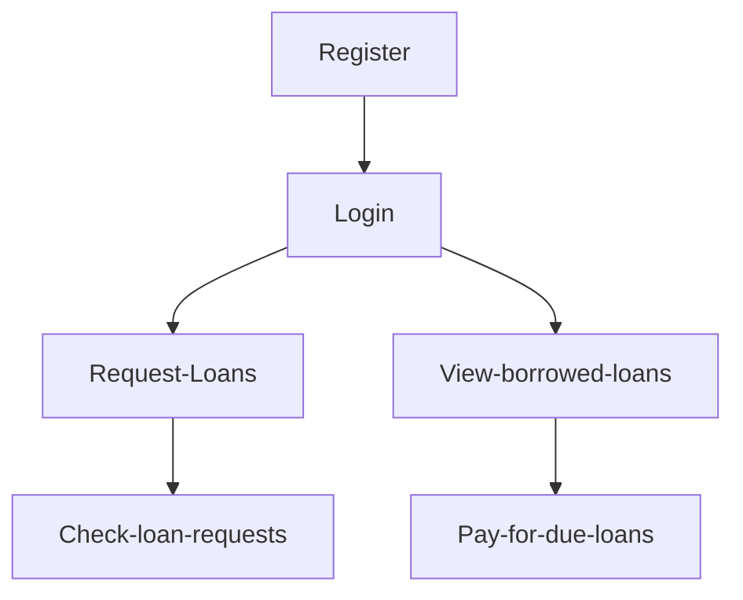
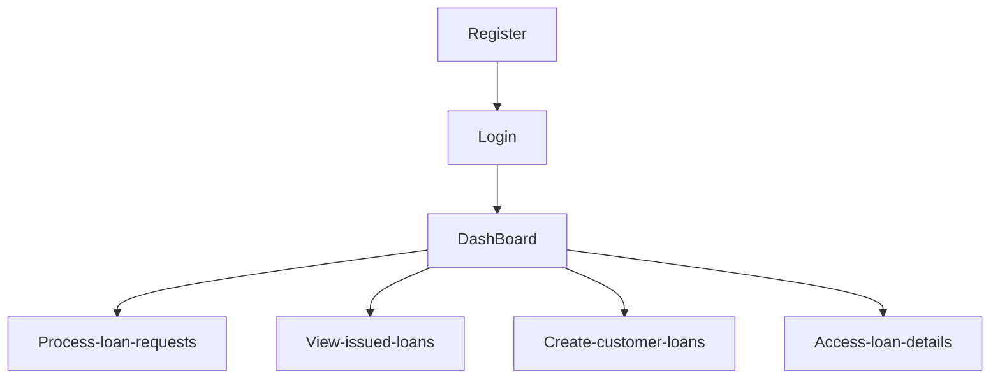
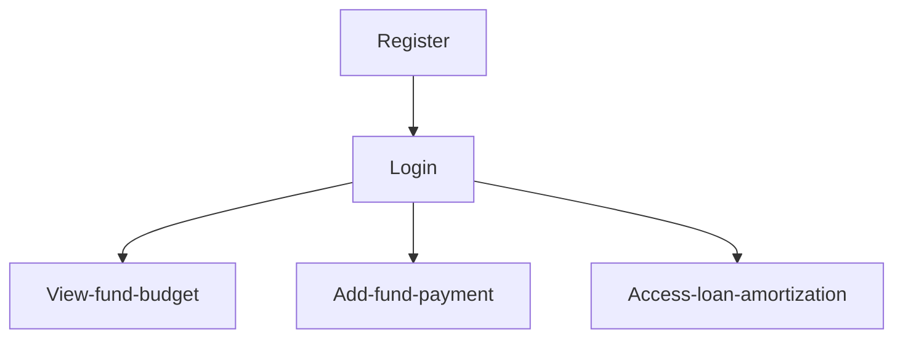

# Django loaner

loaner is an application to used manage bank loans. The bank receives funds from loan providers and lend its customers within the limit of total funds for each customer provider. A user can login to the system suing a username and password.

The database schema of the backend is available in this [link](https://dbdiagram.io/d/64d629b802bd1c4a5ea1a1d2)

## There are three types of users in the application:

- Loan Provider
  - Providing loan fund for the bank.
- Loan Customer
  - Borrowing and paying loans.
- The Bank Personnel
  - Managing provider funds and customer loans.

## Customer user flow diagram



## Banker user flow diagram



## Provider user flow diagram



## Run locally

- Create a `.env` file containing all environment variables:

  ```sh
  DEBUG=True
  SECRET_KEY=secret_key_string
  db_schema=database_schema (postgres)
  db_user=database_username (postgres)
  db_password=database_password (admin)
  db_host=database_host_ip (127.0.0.1)
  db_port=database_host_port(5432)
  db_name=database_name (loaner-db)
  ```

- Create a virtual environment using the following command:

  ```sh
  python -m venv venv --prompt "loaner"
  ```

- Use `poetry` manage the virtual environment and install requirements.

  ```sh
  poetry config virtualenvs.in-project true
  poetry install
  ```

- Use the receipes inside the the `Makefile` interact with django server.

  ```sh
  make migrate
  make migrations
  make superuser
  make run-server
  ```

## Run using docker

- Run the following `docker-compose` command to build , start and run an entire app

  ```sh
  docker-compose up -t --build
  ```

- Run the following `docker-compose` command to Stop containers and removes containers, networks, volumes, and images created by up.

  ```sh
  docker-compose down
  ```

## Postman instructions

- Access the loan API collection using this [link](https://www.postman.com/atfhshm/workspace/loaner)
- Use `dev` postman environment.
- Make sure to log in and authenticate the use.
- Make sure to configure the following environment variables if not found in postman:
  - `url` : <http://127.0.0.1:8000>
  - `JWT` : Is set automatically when the user first signin.
