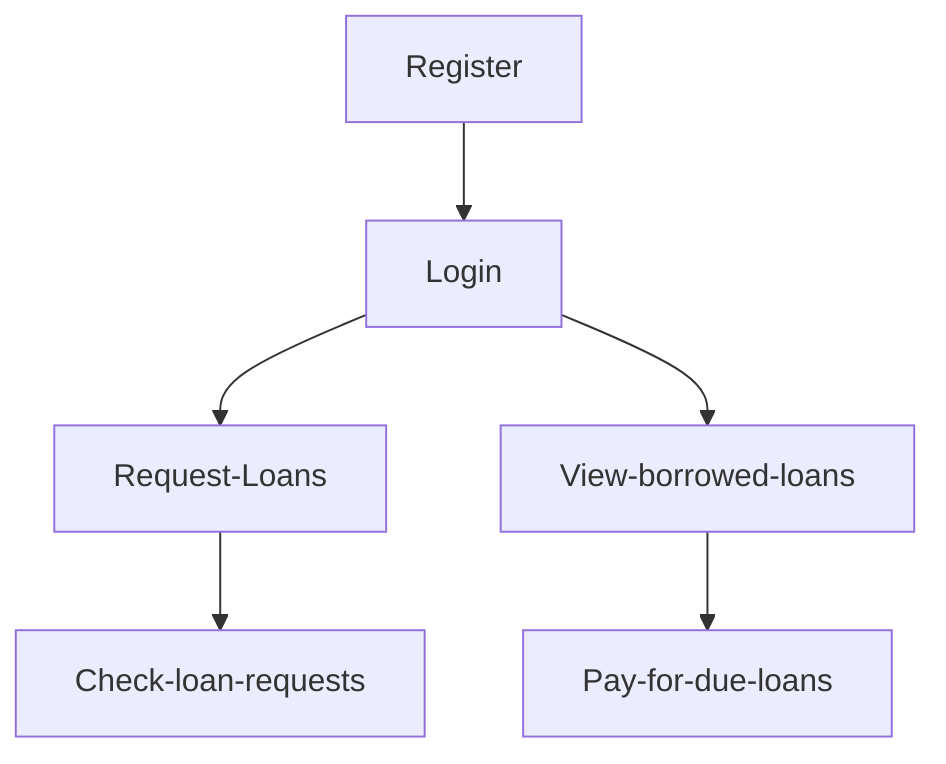
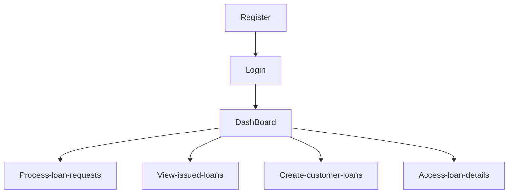
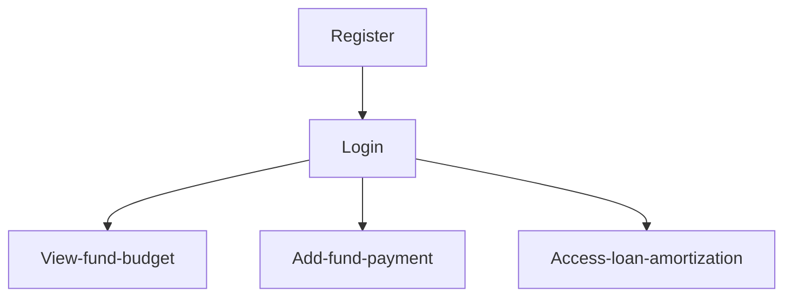

# Django loaner

loaner is an application to used manage bank loans. The bank receives funds from loan providers and lend its customers within the limit of total funds for each customer provider. A user can login to the system suing a username and password.

The database schema of the backend is available in this [link](https://dbdiagram.io/d/64d629b802bd1c4a5ea1a1d2)

## There are three types of users in the application:

- Loan Provider
  - Providing loan fund for the bank.
- Loan Customer
  - Borrowing and paying loans.
- The Bank Personnel
  - Managing provider funds and customer loans.

## Customer user flow diagram

## Banker user flow diagram

## Provider user flow diagram

